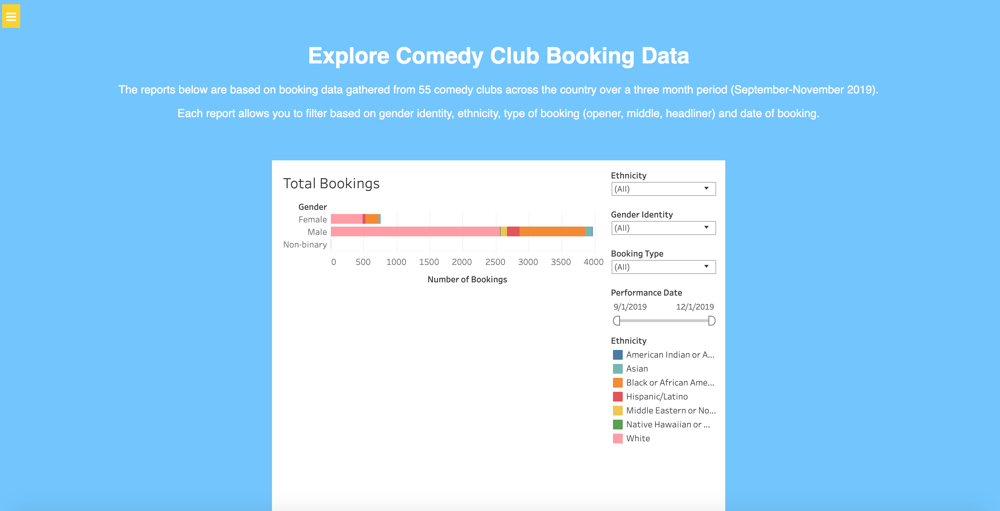

# ProjectCCDB (A Comedy Club Database)

## Description
A web app for tracking gender and race in comedy club bookings in order to understand norms.

## Stack
MySQL database called from PHP and Javascript. Charts made with Tableau. 

## Lessons
The reception of this data was generally good, although we got criticism for not accounting for the fact that there are just not a lot of women and POC in comedy. We were told a non-diverse line up at clubs may not be due to any preferences of the club owner, but simply the demographic make up of who they can choose from. The purpose of the project was not to make any statements in regards to that, just to present the data as it is and let people do what they will with it.

Time permitting, I want to change the UI to be more asethically pleasing and be more intuitive with Bootstrap.
